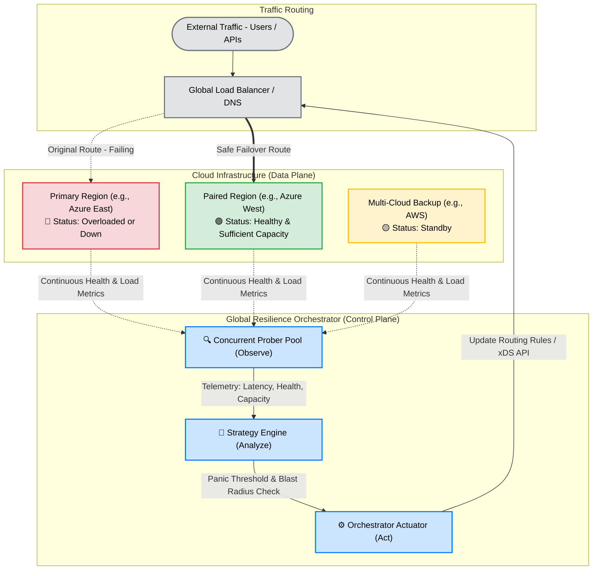
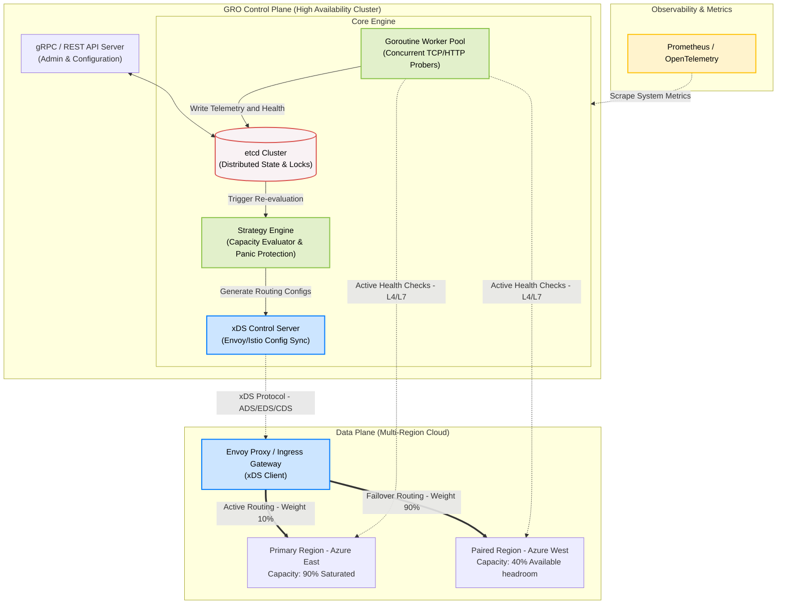

# Global Resilience Orchestrator (GRO)

## Overview
The **Global Resilience Orchestrator (GRO)** is a high-availability control plane designed to manage traffic distribution and service health across multi-region and multi-cloud environments.

[cite_start]In an era where regional cloud outages can disrupt critical national infrastructure—including healthcare, finance, logistics, and transportation—GRO provides a vendor-agnostic abstraction layer that automates regional failover[cite: 47, 51]. [cite_start]It is built to address one of the most fundamental weaknesses in modern cloud architecture: **single-region dependency**[cite: 22].

## Key Features
* [cite_start]**Safe & Predictable Failover**: The hardest part of failover is ensuring it does not become worse than the original failure[cite: 19]. [cite_start]GRO prioritizes stability by evaluating backup region capacity before routing, preventing overloaded backup regions and cascading failures[cite: 20].
* [cite_start]**Blast Radius Containment**: When a region is under heavy stress or completely down, GRO provides a clean mechanism to move traffic, preserve service continuity, and strictly limit the blast radius[cite: 24].
* [cite_start]**Intelligent Traffic Steering**: Moves beyond simple round-robin to use latency-weighted and load-aware selection algorithms, enforcing true **paired-region readiness**[cite: 26].
* **Concurrent Health Probing**: A high-performance monitoring engine utilizing a worker-pool pattern to scale across thousands of regional endpoints.
* **Panic Threshold Protection**: Advanced safety logic that prevents "thundering herd" effects by halting automated failover during global instability.

## Project Architecture

To ensure both broad adaptability and industrial-grade reliability, GRO is designed with a layered architecture.

### 1. High-Level Concept: Safe Regional Failover
At a high level, GRO evaluates regional health and capacity to prevent single-point failures and cascading outages.



### 2. Deep-Dive Control Plane Architecture
Under the hood, GRO utilizes a highly concurrent, distributed engine to ensure the control plane itself remains highly available. The diagram below illustrates the internal component interaction and the xDS-based control-to-data plane communication:



## Designed for Broad Industry Adaptability
[cite_start]While mature tech giants possess internal reliability platforms, GRO is open-sourced to provide a production-ready resilience pattern for organizations lacking such resources[cite: 43].

The architectural approaches here go beyond the benefit of a single employer and are designed to be easily adapted by:
* [cite_start]**Autonomous Driving & AI Infrastructure**: Ensuring continuous telemetry and operation for safety-critical navigation systems[cite: 45].
* [cite_start]**Public-Sector & Healthcare Engineering**: Providing reusable patterns to make the digital systems supporting public services (healthcare, finance, logistics, commerce) more dependable[cite: 56].
* [cite_start]**Startups and Mid-sized Cloud Native Companies**: Offering an accessible framework for multi-region disaster recovery and high availability[cite: 44].

## 🚀 Project Roadmap

### Phase 1: Core Framework & Resilience Foundation (Complete)
- [x] **Standardized Scaffolding**: Implementation of Go-standard project layout and core API models.
- [x] **Worker-Pool Prober**: High-concurrency health monitoring engine with context-aware timeouts.
- [x] **Latency-Weighted Strategy**: Scoring algorithm to optimize user experience based on real-time network conditions.
- [x] **Thread-Safe State Management**: Centralized monitor engine for global infrastructure telemetry.

### Phase 2: Intelligence & Advanced Steering
- [ ] **Dynamic "Panic" Thresholds**: Logic to prevent cascading failures during widespread network partitions.
- [ ] **Capacity-Aware Routing**: Real-time evaluation to ensure the secondary region is not overwhelmed during a traffic shift.
- [ ] **Adaptive Load Shifting**: Real-time weight adjustments based on node saturation (CPU/Memory).

### Phase 3: Ecosystem Integration & Enterprise Scale
- [ ] **Multi-Cloud Adapters**: Native support for Azure Resource Graph and AWS Route53.
- [ ] **Service Mesh Integration**: Support for Istio/Linkerd via xDS APIs for L7 traffic splitting.
- [ ] **Observability Suite**: Exporting metrics via OpenTelemetry and Prometheus.

## Installation & Usage

### Prerequisites
* Go 1.21+

### Build
```bash
go mod download
go build -o gro ./cmd/gro-manager
```