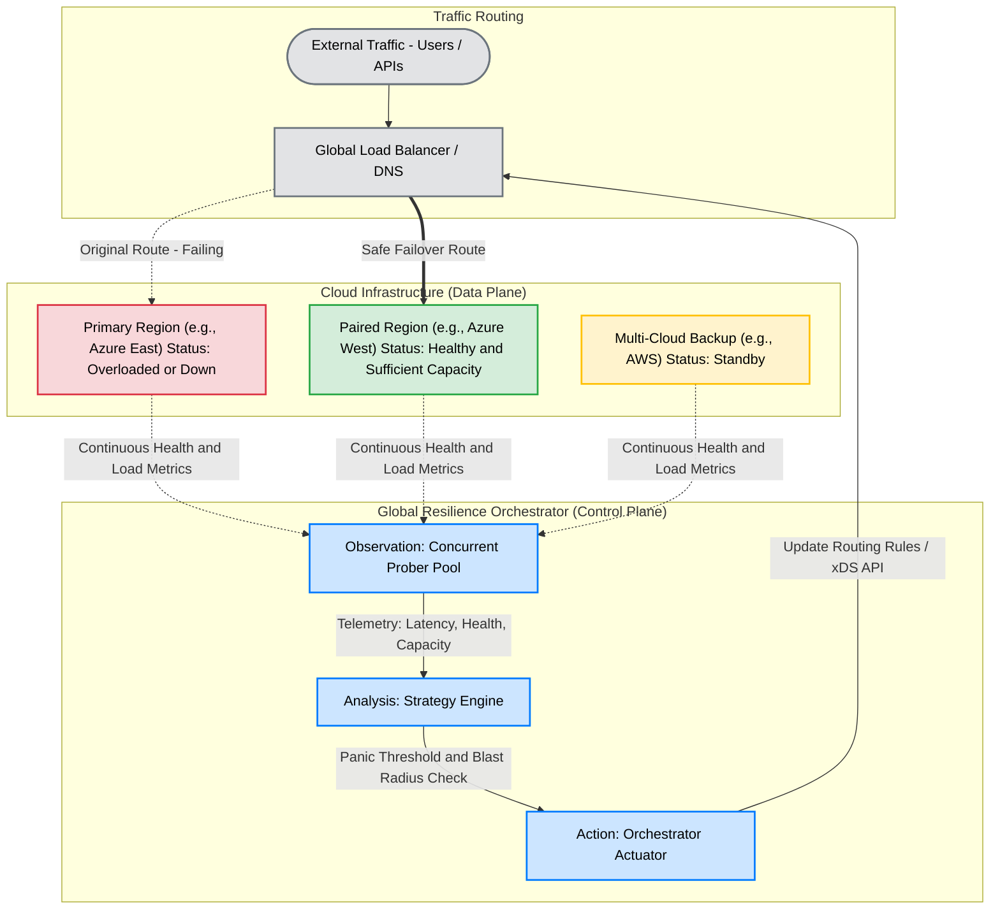
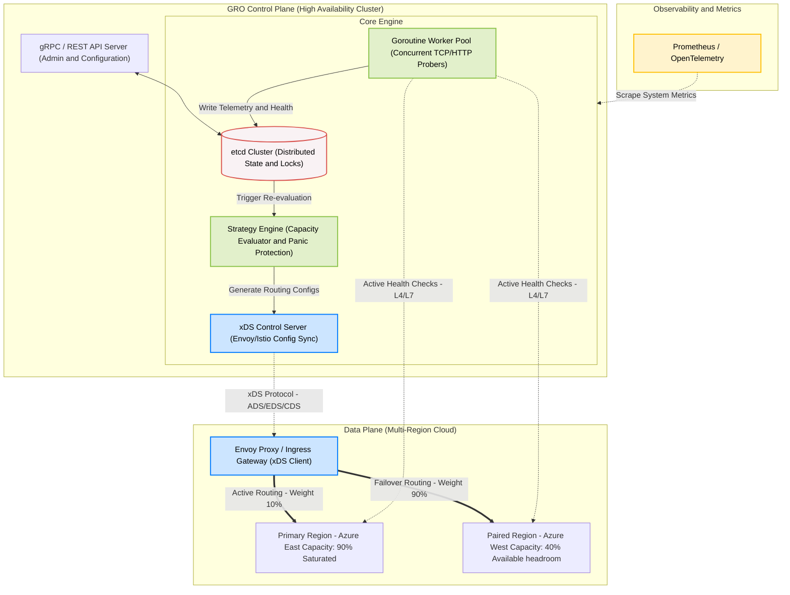

# Global Resilience Orchestrator (GRO)

## Overview
The **Global Resilience Orchestrator (GRO)** is a high-availability control plane designed to manage traffic distribution and service health across multi-region and multi-cloud environments. Unlike cloud-native tools that are often limited to a single provider's ecosystem, GRO serves as a vendor-neutral abstraction layer that automates regional failover and ensures operational continuity.

In the modern cloud landscape, relying solely on a single cloud service provider creates a systemic risk where a failure in a global control plane can paralyze services across all regions simultaneously. GRO addresses this fundamental vulnerability by providing an independent orchestration logic that operates outside the failure domain of any single vendor.

## The Resilience Gap in Modern Infrastructure
Standard cloud services operate under a **Shared Responsibility Model**. While providers manage the availability of the underlying physical infrastructure, the customer remains responsible for the reliability of the application logic and deployment orchestration. GRO fills the critical technical gap where standard cloud tools fall short:

* **Control Plane Isolation**: Traditional cross-region failover within a single provider can still fail if the provider's central identity or routing service undergoes a global outage. GRO provides an externalized decision-making engine to maintain continuity even when a provider's internal management tools are unresponsive.
* **Prevention of Synchronized Failures**: As demonstrated by the 2024 CrowdStrike-related outages, software-driven failures can propagate across multiple regions in seconds. GRO implements health-aware logic to halt traffic shifts to regions that are already degraded or under stress, preventing a thundering herd effect.
* **Quantifiable Availability Improvement**: While cloud providers offer infrastructure SLAs of $99.99\%$, the composite SLA of a complex system often drops to $99.9\%$ or lower. During a regional outage, availability can drop to zero. GRO targets a high-availability objective of $99.9\%$ specifically during large-scale provider failures, reducing annual potential downtime from over 17 hours to under 9 hours.

## Real-World Evidence for Independent Orchestration
Cloud infrastructure is not invincible, and internal failover mechanisms often fail during large-scale events. GRO's architecture is necessitated by the following industry-shaping outages:

* **AWS US-EAST-1 Connectivity Collapse (Dec 2021)**: A network device impairment in the primary US-East region took down major services including Netflix and Disney+. Crucially, the AWS management console itself was impacted, preventing users from initiating manual recovery—a scenario GRO is designed to automate through its independent control plane.
* **Azure Geo-Failover Failure (Sept 2024)**: A service degradation in the US geography demonstrated that internal failover mechanisms can fail when metadata synchronization is lost. Manual intervention took hours, whereas GRO’s strategy engine uses real-time telemetry to enforce failover when internal tools become unresponsive.
* **GCP Europe-West9 Physical Disaster (April 2023)**: A fire and water intrusion at a Paris data center caused total cluster loss. Organizations relying solely on localized redundancy faced extended downtime, highlighting the need for GRO’s multi-cloud and cross-region load-sharing capabilities.
* **Global Control Plane Errors**: Incidents like the Azure DNS outage (May 2019) prove that logic errors in a provider's global management layer can bypass all regional redundancy. GRO operates outside these failure domains to preserve traffic routing.

## Key Technical Components
* **Safe and Predictable Failover**: GRO prioritizes system stability by evaluating the actual capacity of a backup region before initiating a traffic shift, ensuring that the failover does not overwhelm healthy infrastructure.
* **Blast Radius Containment**: The orchestrator provides a clean mechanism to isolate failing components, preserving service for the majority of users while troubleshooting occurs.
* **Intelligent Traffic Steering**: Utilizes latency-weighted and load-aware selection algorithms to enforce true paired-region readiness across disparate cloud environments.
* **Concurrent Health Probing**: A high-performance monitoring engine designed to scale across thousands of regional endpoints using a worker-pool pattern.
* **Panic Threshold Protection**: Advanced safety logic that halts automated routing changes during periods of global network instability to prevent unintended cascading effects.

## Project Architecture

### 1. High-Level Concept: Safe Regional Failover
GRO evaluates regional health and capacity to prevent single-point failures and cascading outages across modern distributed systems.

### 2. Deep-Dive Control Plane Architecture
The GRO control plane utilizes a highly concurrent distributed engine to ensure its own high availability. It communicates with the data plane via the xDS protocol.

## Target Beneficiaries
GRO is designed to democratize high-availability expertise for organizations that lack the resources of hyperscale cloud providers:
Startups and Small-to-Mid-Sized Enterprises (SMEs): Provides a production-ready resilience blueprint, allowing smaller teams to implement advanced disaster recovery without hiring large SRE organizations.
Critical National Infrastructure (Healthcare, Finance, Logistics): Enhances the dependability of digital services that support the U.S. economy and public welfare by reducing the risk of cascading failures.
Multi-Cloud Enterprises: Offers a vendor-neutral framework for organizations that must operate across different cloud providers (e.g., AWS and Azure) to avoid vendor lock-in and mitigate provider-wide outages.

## Roadmap
### Phase 1: Core Framework and Resilience Foundation (Complete)
- [x] **Standardized Scaffolding**: Implementation of industry-standard project layouts and core API models.
- [x] **Worker-Pool Prober**: High-concurrency health monitoring engine with context-aware timeouts.
- [x] **Latency-Weighted Strategy**: Scoring algorithms to optimize user experience based on real-time network telemetry.

### Phase 2: Intelligence and Advanced Steering
- [ ] **Dynamic Panic Thresholds**: Logic to identify and block routing changes during massive network partitions.
- [ ] **Capacity-Aware Routing**: Real-time integration to ensure backup regions have sufficient headroom before failover.
- [ ] **Adaptive Load Shifting**: Weight adjustments based on live node saturation (CPU/Memory).

### Phase 3: Ecosystem Integration
- [ ] **Multi-Cloud Adapters**: Native integration support for major cloud providers to simplify discovery.
- [ ] **Service Mesh Integration**: Support for Istio and Linkerd via xDS APIs for advanced L7 traffic management.
- [ ] **Observability Suite**: Comprehensive metrics exporting via OpenTelemetry and Prometheus.